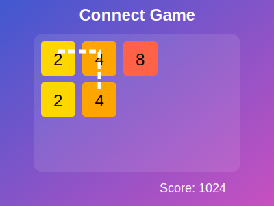

# Connect Game



## Description

Connect Game is a Java implementation of a puzzle game similar to 2248, featuring a graphical user interface. Players connect tiles with matching values or increasing powers of two to score points and create higher-value tiles. This project demonstrates object-oriented programming, grid-based game logic, file I/O operations, event handling, and GUI development in Java.

## Features

- Grid-based gameplay with customizable dimensions
- Tile connection and merging mechanics
- Score tracking and update
- Random tile generation within specified levels
- Game state saving and loading
- Graphical user interface (GUI) with interactive grid
- Color-coded tiles based on their values
- Console-based interface for testing purposes

## Project Structure

The project consists of three main packages:

### hw3 Package (Core Game Logic)

1. `ConnectGame`: Manages game logic, player actions, and scoring
2. `Grid`: Represents the game board and handles tile placement
3. `GameFileUtil`: Provides functionality for saving and loading game states

### api Package (Interfaces and Utility Classes)

1. `Tile`: Represents a single tile in the game grid
2. `ScoreUpdateListener`: Interface for handling score update events
3. `ShowDialogListener`: Interface for displaying dialog messages

### ui Package (User Interface Components)

1. `GameMain`: Main class to run the game with GUI
2. `GamePanel`: Main panel containing the game grid and controls
3. `GridVis`: Visual representation of the game grid
4. `TileVis`: Visual representation of individual tiles
5. `ColorTheme`: Manages color schemes for tiles
6. `GameConsole`: Console-based UI for testing purposes

## How to Play

1. Run the `GameMain` class to start the game with GUI
2. Click on a tile to start a selection
3. Drag over adjacent tiles to continue the selection
   - The first two tiles must have the same value
   - Subsequent tiles can have the same value or be the next power of two
4. Release to complete the selection
   - Selected tiles are removed
   - The last selected tile is upgraded
   - New random tiles fill the empty spaces
5. Repeat to create higher-value tiles and increase your score
6. Use the "Save" and "Load" buttons to manage game states

## Usage

To use the Connect Game in your project:

```java
import hw3.ConnectGame;
import hw3.Grid;
import hw3.GameFileUtil;
import ui.GameMain;

// Run the game with GUI
public static void main(String[] args) {
    GameMain.main(args);
}

// Or create a game instance for custom use
ConnectGame game = new ConnectGame(5, 8, 1, 4, new Random());
game.radomizeTiles();

// Make a selection
game.tryFirstSelect(0, 0);
game.tryContinueSelect(1, 0);
game.tryFinishSelection(1, 0);

// Save and load game states
game.save("game_state.txt");
game.load("game_state.txt");
```

## Example (Console-based for testing)

```java
import hw3.ConnectGame;
import ui.GameConsole;

public class ConnectGameDemo {
    public static void main(String[] args) {
        ConnectGame game = new ConnectGame(5, 8, 1, 4, new Random());
        GameConsole console = new GameConsole();
        
        game.setListeners(console, console);
        
        game.radomizeTiles();
        System.out.println("Initial grid:");
        System.out.println(game.getGrid());
        
        game.tryFirstSelect(0, 0);
        game.tryContinueSelect(1, 0);
        game.tryFinishSelection(1, 0);
        
        System.out.println("After move:");
        System.out.println(game.getGrid());
    }
}
```

## Future Improvements

- Implement different game modes (e.g., timed, move-limited)
- Add power-ups or special tiles
- Create an AI opponent for single-player mode
- Implement online multiplayer functionality
- Enhance the GUI with animations and sound effects
- Add difficulty levels and game statistics

## Author

Abhay Prasanna Rao

## License

This project is open source and available under the [MIT License](LICENSE).